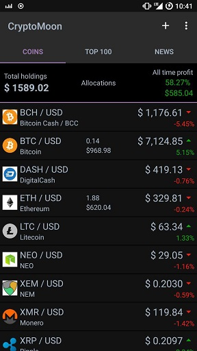

# CryptoMoon

- tracking prices for crypto currencies, top 100 coins, twitter news by tag
- 100% code on Kotlin
- CryptoCompare and CoinMarket API
- libraries:
  Dagger 2.11
  RxJava2
  RxBinding
  Retrofit2
  Room
  Kluent
  Picasso
  Android-SpinKit
  MPAndroidChart
  Twitter
- feel free to contribute, pull to dev

App available on Google Play: https://play.google.com/store/apps/details?id=com.rmnivnv.cryptomoon

